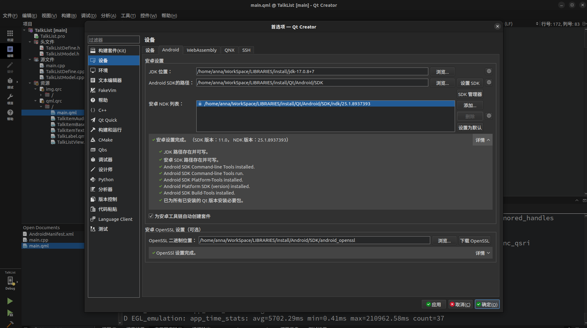
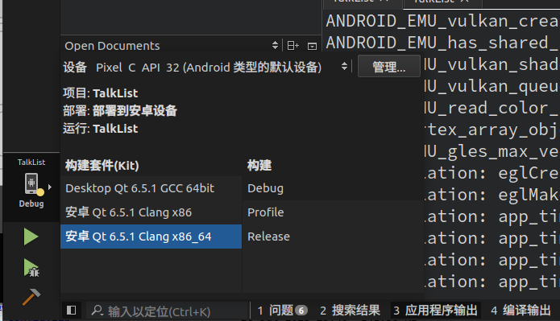

llama.android
================

## reference
1. https://blog.csdn.net/yao_hou/article/details/122281766
2. https://github.com/gongjianbo/MyTestCode.git
3. https://github.com/gongjianbo/MyTestCode/tree/master/Qml/TalkList

## how to build
1. install Qt6 (>=6.5.1) with desktop gcc and android build toolkits on your workstation.
2. setup your QtCreator in `Preferences -> Device -> Android` like this: 
3. open `*.pro` file with QtCreator, select `Desktop Qt 6.*.* GCC 64bit` and `Android Qt 6.*.* Clang x86_64` as build toolkits.
4. use the buttons bottom-left to start build or debug.