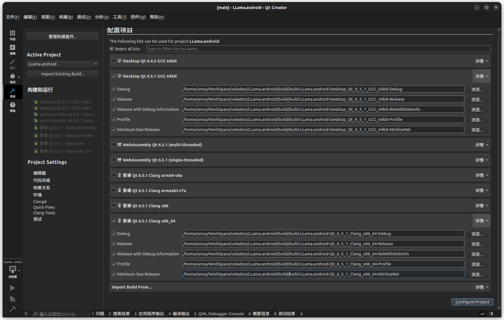
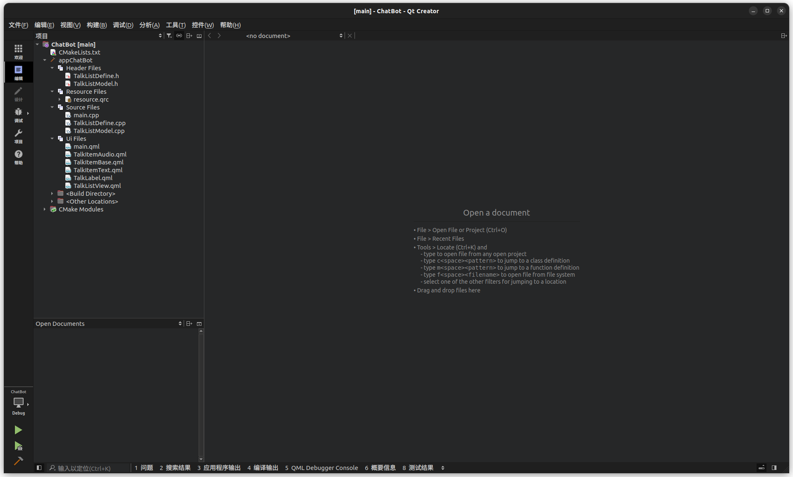
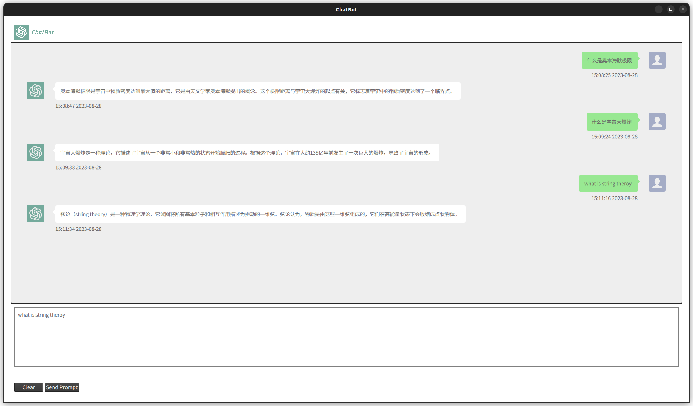

llama.android
================

## reference
1. [C++ Qt 实现微信聊天界面](https://blog.csdn.net/yao_hou/article/details/122281766)
2. [TalkList with QML](https://github.com/gongjianbo/MyTestCode/tree/master/Qml/TalkList)
3. [llama.cpp](https://github.com/ggerganov/llama.cpp)
4. [Chinese-plus-Pygmalion-7b-GPTQ](https://huggingface.co/coyude/Chinese-plus-Pygmalion-7b-GPTQ)

## how to build
1. install Qt6 (>=6.5.1) with desktop gcc and android build toolkits on your workstation.
2. setup your QtCreator in `Preferences -> Device -> Android` like this: 
3. open `*CMakeList.txt` file with QtCreator, select `Desktop Qt 6.*.* GCC 64bit` and `Android Qt 6.*.* Clang x86_64` as build toolkits, in the detail settings of the two toolkit, you can edit the output dir: 
4. after configuration done, you can see the project structure：
5. use the buttons bottom-left to start build or debug.
6. the app looks like: